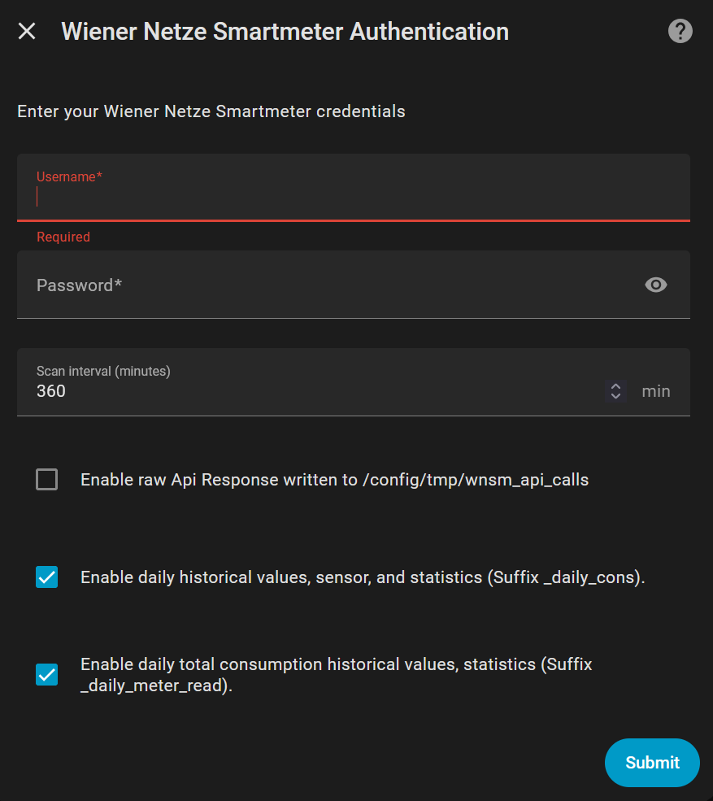
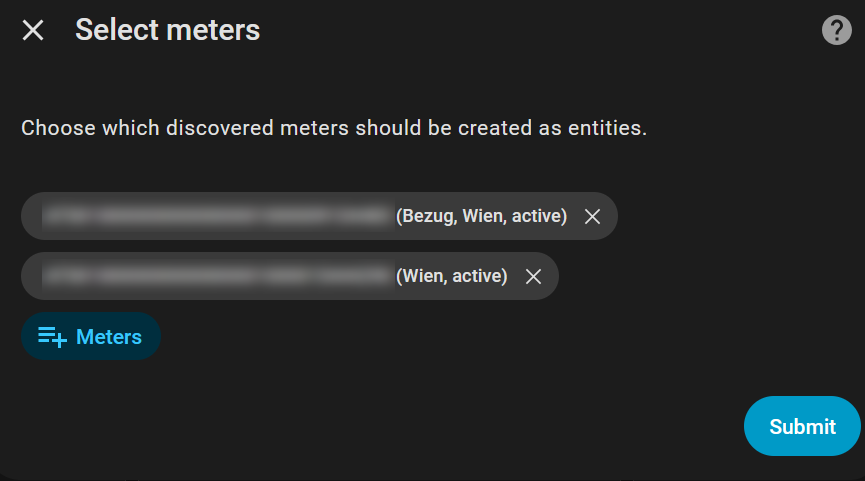
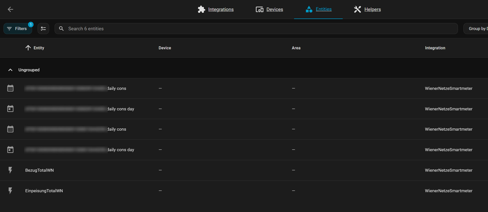
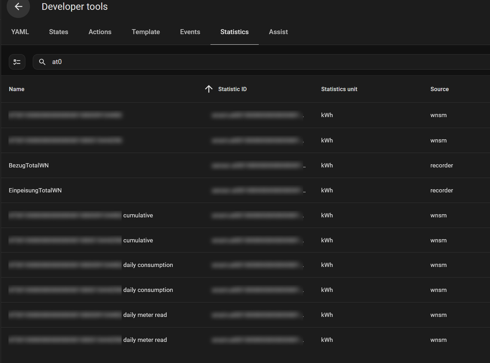

# Wiener Netze Smartmeter (WNSM) - User Documentation

This integration imports Wiener Netze smart meter data into Home Assistant and exposes:
- sensor entities
- recorder statistics streams for Energy Dashboard and history views

## Configuration Mode

This custom component is configurable through the Home Assistant UI only.
YAML configuration is not supported.

## Initial Setup (Login Screen)

Use the Home Assistant integration dialog to enter your Wiener Netze username and password.



After login, Home Assistant opens meter selection. Keep the active meters selected and submit.
Inactive meters can appear in the list, but are usually not preselected.



## What You Get

For each selected meter (`zaehlpunkt`), the integration can create up to 3 sensor entities.

Entities view example (meter numbers blurred, suffixes kept readable):



Statistics view example (meter numbers blurred, suffixes kept readable):



## Created Sensors

`<zaehlpunkt>` below means your meter ID, for example `at0010000000000000001000009111111`.

| Entity ID pattern | Created by default | Type | Description |
| --- | --- | --- | --- |
| `sensor.<zaehlpunkt>` | Yes | Sensor entity | Main total energy sensor (kWh), `total_increasing`. |
| `sensor.<zaehlpunkt>_daily_cons` | Yes (if `_daily_cons` toggle is enabled) | Sensor entity | Latest cumulative value from daily historical consumption stream (kWh). |
| `sensor.<zaehlpunkt>_daily_cons_day` | Yes (if `_daily_cons` toggle is enabled) | Sensor entity | Latest day value (daily delta) derived from the daily consumption stream (kWh). |

Important:
- There is currently no dedicated `sensor.<zaehlpunkt>_daily_meter_read` entity.
- `_daily_meter_read` is implemented as recorder statistics (see below).

## Recorder Statistics Streams

For each selected meter, these statistic IDs are used:

| Statistic ID pattern | Default | Controlled by |
| --- | --- | --- |
| `wnsm:<zaehlpunkt_lowercase>` | Enabled | Always on |
| `wnsm:<zaehlpunkt_lowercase>_cum_abs` | Enabled | Always on |
| `wnsm:<zaehlpunkt_lowercase>_daily_cons` | Enabled | Toggle: `Enable daily historical values, sensor, and statistics (Suffix _daily_cons).` |
| `wnsm:<zaehlpunkt_lowercase>_daily_meter_read` | Enabled | Toggle: `Enable daily total consumption historical values, statistics (Suffix  _daily_meter_read).` |

## Configuration Defaults

Default values in the UI:
- `Scan interval (minutes)`: `360` (6 hours)
- `Enable raw Api Response written to /config/tmp/wnsm_api_calls`: `False`
- `Enable daily historical values, sensor, and statistics (Suffix _daily_cons).`: `True`
- `Enable daily total consumption historical values, statistics (Suffix  _daily_meter_read).`: `True`
- `Meters`: active/ready meters are pre-selected by default

## Toggle Behavior TEST

### `_daily_cons` toggle

When enabled (default):
- Creates sensor entities:
  - `sensor.<zaehlpunkt>_daily_cons`
  - `sensor.<zaehlpunkt>_daily_cons_day`
- Imports/maintains statistics stream:
  - `wnsm:<zaehlpunkt_lowercase>_daily_cons`

When disabled:
- The two `_daily_cons*` sensors are not created.
- No new `_daily_cons` statistics are imported.

### `_daily_meter_read` toggle

When enabled (default):
- Imports/maintains statistics stream:
  - `wnsm:<zaehlpunkt_lowercase>_daily_meter_read`

When disabled:
- No new `_daily_meter_read` statistics are imported.
- Existing other sensors/entities are unaffected.

## Typical Tile Card Example

Show daily value (not cumulative):

```yaml
type: tile
entity: sensor.at0010000000000000001000009111111_daily_cons_day
vertical: false
features_position: bottom
```

## Dashboard Card Examples

User note:
- All examples below use the sample `zaehlpunkt` ID `at0010000000000000001000009111111`.
- Replace `at0010000000000000001000009111111` with your own meter ID in every `entity` / statistics ID.

### Daily Consumption

```yaml
chart_type: bar
period: day
type: statistics-graph
title: Daily Consumption
entities:
  - wnsm:at0010000000000000001000009111111
hide_legend: true
stat_types:
  - change
```

### Total Consumption per Day from Hourly Historical Sum

```yaml
chart_type: bar
period: day
type: statistics-graph
title: Total Consumption per Day from Hourly Sum
days_to_show: 30
entities:
  - wnsm:at0010000000000000001000009111111_cum_abs
stat_types:
  - state
hide_legend: true
```

### Total Consumption per Day from Historical Day Sum

```yaml
chart_type: bar
period: day
type: statistics-graph
title: Total Consumption per Day from Day Sum
days_to_show: 30
entities:
  - wnsm:at0010000000000000001000009111111_daily_cons
stat_types:
  - state
hide_legend: true
```

### Total Consumption per Day from Cumulative Total

```yaml
chart_type: bar
period: day
type: statistics-graph
title: Einspeisung kumuliert (30 Tage)
days_to_show: 30
entities:
  - wnsm:at0010000000000000001000009111111_daily_meter_read
stat_types:
  - state
hide_legend: true
```

### Yesterday Daily Consumption - Card from Statistics

```yaml
type: statistic
entity: sensor.at0010000000000000001000009111111
period:
  calendar:
    period: month
stat_type: change
```

### Yesterday Daily Consumption - Tile

```yaml
type: tile
entity: sensor.at0010000000000000001000009111111_daily_cons_day
vertical: false
features_position: bottom
```

### Yesterday Total Consumption from Cumulative Total - Tile

```yaml
type: tile
entity: sensor.at0010000000000000001000009111111
vertical: false
features_position: bottom
```

### Yesterday Total Consumption from Historical Hourly Sum - Tile

```yaml
type: tile
entity: sensor.at0010000000000000001000009111111_daily_cons
vertical: false
features_position: bottom
```

Important note:
- If the smart meter hardware is replaced (for example due to a defect), totals from Historical Day and Historical Hour can differ from Total Consumption.
- Historical Day and Historical Hour totals should stay consistent with each other over time.
- Total Consumption corresponds to the "Zaehlerstand" in the Wiener Netze Smart Meter Portal.

## After Changing Options

After changing options in the integration:
- Home Assistant reloads the integration automatically.
- If needed, run a full Home Assistant restart to force immediate entity/statistics refresh.

## Credits

This integration is based on the original work by DarwinsBuddy:
- https://github.com/DarwinsBuddy/WienerNetzeSmartmeter
