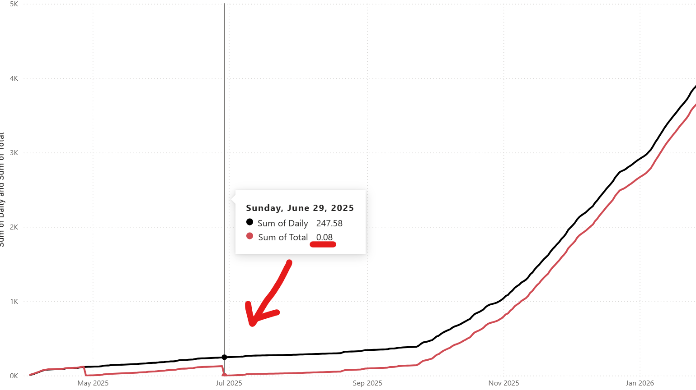

# Wiener Netze Smartmeter 3.0 (WNSM30) - Benutzerdokumentation

Diese Integration importiert Wiener Netze Smartmeter-Daten in Home Assistant und stellt bereit:
- Sensor-Entitaeten
- Recorder-Statistik-Streams fuer Energy Dashboard und Verlaufsansichten

## Konfigurationsmodus

Diese Custom Component ist nur ueber die Home Assistant UI konfigurierbar.
YAML-Konfiguration wird nicht unterstuetzt.

## Erste Einrichtung (Login-Bildschirm)

Verwende den Home Assistant Integrationsdialog, um deinen Wiener Netze Benutzernamen und dein Passwort einzugeben.


Nach dem Login oeffnet Home Assistant die Zaehlerauswahl. Lass die vorausgewaehlten Zaehler ausgewaehlt und bestaetige.
Standardmaessig sind aktive und smart-meter-bereite Zaehler vorausgewaehlt.
Wenn kein Zaehler diesen Status hat, werden alle gefundenen Zaehler vorausgewaehlt.
Inaktive Zaehler koennen in der Liste erscheinen.


## Was du bekommst

Fuer jeden ausgewaehlten Zaehler (`zaehlpunkt`) kann die Integration bis zu 3 Sensor-Entitaeten erstellen.

Beispiel Entitaetenansicht (Zaehlernummern unkenntlich gemacht, Suffixe lesbar):


Beispiel Statistikansicht (Zaehlernummern unkenntlich gemacht, Suffixe lesbar):


## Erstellte Sensoren

`<zaehlpunkt>` unten bedeutet deine Zaehler-ID, zum Beispiel `at0010000000000000001000009111111`.

| Entity ID pattern | Standardmaessig erstellt | Typ | Beschreibung |
| --- | --- | --- | --- |
| `sensor.<zaehlpunkt>` | Ja | Sensor-Entitaet | Hauptsensor fuer Gesamtenergie (kWh), `total_increasing`. |
| `sensor.<zaehlpunkt>_daily_cons` | Ja (wenn `_daily_cons` aktiviert ist) | Sensor-Entitaet | Neuester kumulativer Wert aus dem taeglichen historischen Verbrauchs-Stream (kWh). |
| `sensor.<zaehlpunkt>_daily_cons_day` | Ja (wenn `_daily_cons` aktiviert ist) | Sensor-Entitaet | Neuester Tageswert (taegliche Differenz) aus dem taeglichen Verbrauchs-Stream (kWh). |

Wichtig:
- Es gibt derzeit keine dedizierte `sensor.<zaehlpunkt>_daily_meter_read` Entitaet.
- `_daily_meter_read` ist als Recorder-Statistik umgesetzt (siehe unten).

## Recorder-Statistik-Streams

Fuer jeden ausgewaehlten Zaehler werden diese Statistik-IDs verwendet:

| Statistic ID pattern | Standard | Gesteuert durch |
| --- | --- | --- |
| `wnsmeter30:<zaehlpunkt_lowercase>` | Aktiviert | Immer aktiv |
| `wnsmeter30:<zaehlpunkt_lowercase>_cum_abs` | Aktiviert | Immer aktiv |
| `wnsmeter30:<zaehlpunkt_lowercase>_daily_cons` | Aktiviert | Schalter: `Tägliche historische Werte, Sensor und Statistiken aktivieren (Suffix _daily_cons).` |
| `wnsmeter30:<zaehlpunkt_lowercase>_daily_meter_read` | Aktiviert | Schalter: `Tägliche historische Gesamtverbrauchswerte (Zählerstand) und Statistiken aktivieren (Suffix _daily_meter_read).` Energy-Dashboard-Stream (`sum` ist monoton). |

## Konfigurationsstandardwerte

Standardwerte in der UI:
- `Abfrageintervall (Minuten)`: `360` (6 Stunden, erlaubter Bereich `5-720`)
- `Tägliche historische Werte, Sensor und Statistiken aktivieren (Suffix _daily_cons).`: `True`
- `Tägliche historische Gesamtverbrauchswerte (Zählerstand) und Statistiken aktivieren (Suffix _daily_meter_read).`: `True`
- `Zähler`: aktive/smart-meter-bereite Zaehler sind standardmaessig vorausgewaehlt; falls keiner passt, werden alle gefundenen Zaehler vorausgewaehlt
- `Roh-API-Antworten nach /config/tmp/wnsm_api_calls schreiben`: `False`

## Schalterverhalten

### `_daily_cons` Schalter

Wenn aktiviert (Standard):
- Erstellt Sensor-Entitaeten:
  - `sensor.<zaehlpunkt>_daily_cons`
  - `sensor.<zaehlpunkt>_daily_cons_day`
- Importiert/pflegt Statistik-Stream:
  - `wnsmeter30:<zaehlpunkt_lowercase>_daily_cons`

Wenn deaktiviert:
- Die beiden `_daily_cons*` Sensoren werden nicht erstellt.
- Es werden keine neuen `_daily_cons` Statistiken importiert.

### `_daily_meter_read` Schalter

Wenn aktiviert (Standard):
- Importiert/pflegt Statistik-Stream:
  - `wnsmeter30:<zaehlpunkt_lowercase>_daily_meter_read`

Wenn deaktiviert:
- Es werden keine neuen `_daily_meter_read` Statistiken importiert.
- Vorhandene andere Sensoren/Entitaeten bleiben unveraendert.

## Typisches Tile Card Beispiel

Tageswert anzeigen (nicht kumuliert):

```yaml
type: tile
entity: sensor.at0010000000000000001000009111111_daily_cons_day
vertical: false
features_position: bottom
```

## Dashboard Card Beispiele

Hinweis:
- Alle Beispiele unten verwenden die Beispiel-`zaehlpunkt`-ID `at0010000000000000001000009111111`.
- Ersetze `at0010000000000000001000009111111` in jeder `entity` / Statistik-ID durch deine eigene Zaehler-ID.

### Taeglicher Verbrauch

```yaml
chart_type: bar
period: day
type: statistics-graph
title: Taeglicher Verbrauch
entities:
  - wnsmeter30:at0010000000000000001000009111111
hide_legend: true
stat_types:
  - change
```

### Gesamtverbrauch pro Tag aus stuendlicher historischer Summe

```yaml
chart_type: bar
period: day
type: statistics-graph
title: Gesamtverbrauch pro Tag aus stuendlicher Summe
days_to_show: 30
entities:
  - wnsmeter30:at0010000000000000001000009111111_cum_abs
stat_types:
  - state
hide_legend: true
```

### Gesamtverbrauch pro Tag aus historischer Tagessumme

```yaml
chart_type: bar
period: day
type: statistics-graph
title: Gesamtverbrauch pro Tag aus Tagessumme
days_to_show: 30
entities:
  - wnsmeter30:at0010000000000000001000009111111_daily_cons
stat_types:
  - state
hide_legend: true
```

### Gesamtverbrauch pro Tag aus kumuliertem Gesamtwert

```yaml
chart_type: bar
period: day
type: statistics-graph
title: Gesamtverbrauch kumuliert (30 Tage)
days_to_show: 30
entities:
  - wnsmeter30:at0010000000000000001000009111111_daily_meter_read
stat_types:
  - state
hide_legend: true
```

### Verbrauch gestern - Karte aus Statistik

```yaml
type: statistic
entity: sensor.at0010000000000000001000009111111
period:
  calendar:
    period: month
stat_type: change
```

### Verbrauch gestern - Tile

```yaml
type: tile
entity: sensor.at0010000000000000001000009111111_daily_cons_day
vertical: false
features_position: bottom
```

### Gesamtverbrauch gestern aus kumuliertem Gesamtwert - Tile

```yaml
type: tile
entity: sensor.at0010000000000000001000009111111
vertical: false
features_position: bottom
```

### Gesamtverbrauch gestern aus historischer stuendlicher Summe - Tile

```yaml
type: tile
entity: sensor.at0010000000000000001000009111111_daily_cons
vertical: false
features_position: bottom
```

Wichtiger Hinweis:
- Wenn die Smartmeter-Hardware getauscht wird (zum Beispiel wegen eines Defekts), koennen Summen aus Historical Day und Historical Hour vom Total Consumption Wert abweichen.
- Historical Day und Historical Hour Summen sollten ueber die Zeit miteinander konsistent bleiben.
- Total Consumption entspricht dem "Zaehlerstand" im Wiener Netze Smart Meter Portal.



In diesem Beispiel wurde die Wiener Netze Smartmeter-Hardware getauscht, und Total Consumption (Zaehlerstand) wurde auf null zurueckgesetzt.

## Energy Dashboard

Wenn bei dir ein Smartmeter-Hardwaretausch stattgefunden hat, empfehlen wir die Nutzung der Statistik mit Suffix `_daily_meter_read`.
Andernfalls kann dein Tageswert falsch sein.

## Nach dem Aendern von Optionen

Nach dem Aendern von Optionen in der Integration:
- Home Assistant laedt die Integration automatisch neu.
- Du kannst dort auch die ausgewaehlten Zaehler aendern.
- Falls noetig, fuehre einen kompletten Home Assistant Neustart aus, um sofortiges Aktualisieren von Entitaeten/Statistiken zu erzwingen.

## Credits

Diese Integration basiert auf der Originalarbeit von DarwinsBuddy:
- https://github.com/DarwinsBuddy/WienerNetzeSmartmeter
