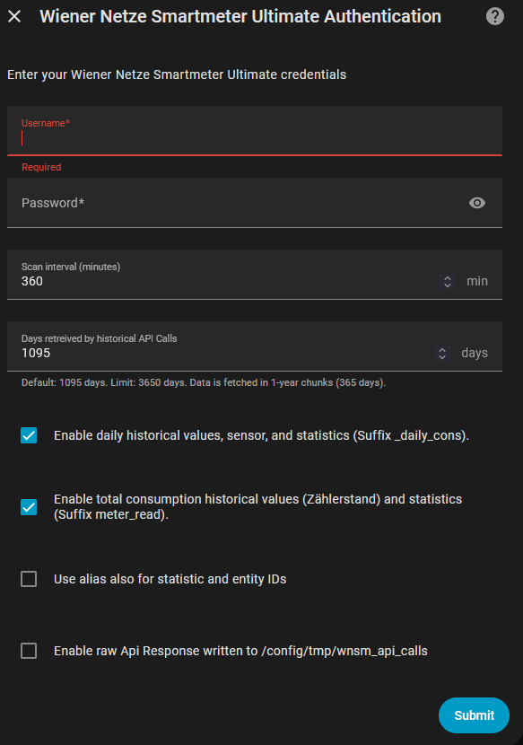
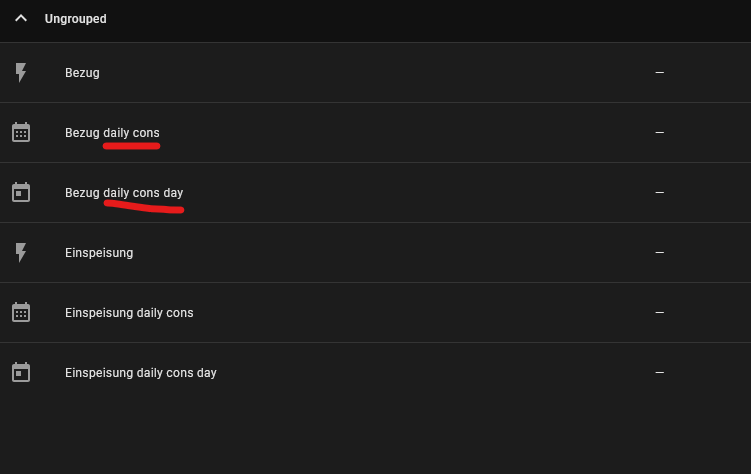
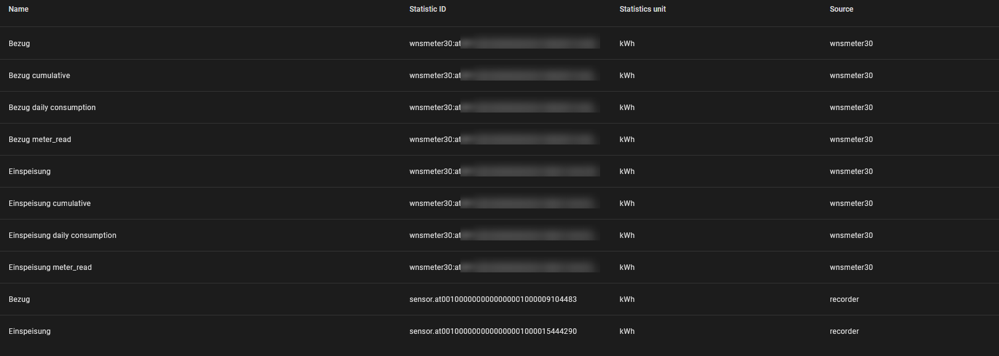
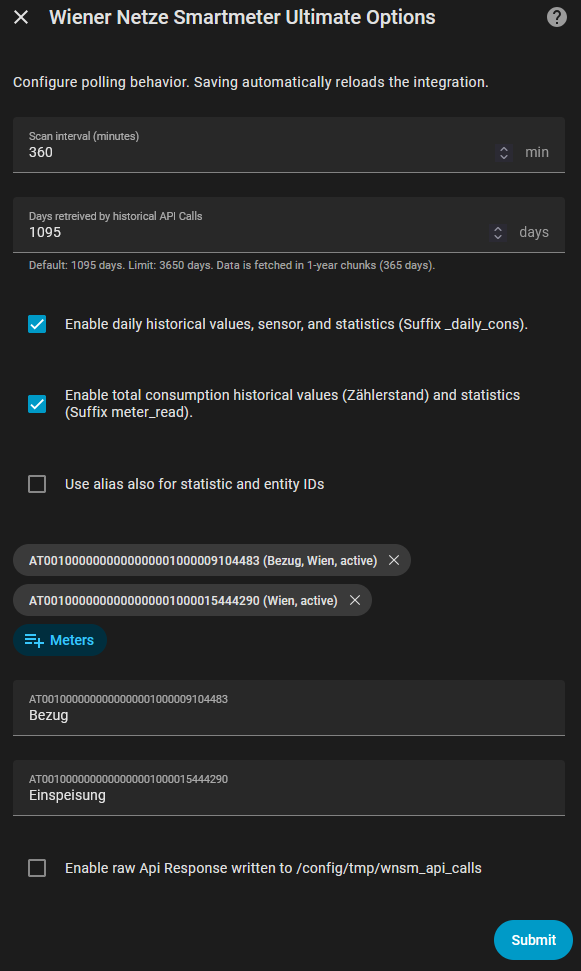

# Wiener Netze Smartmeter Ultimate - Benutzerdokumentation

Diese Integration importiert Wiener Netze Smartmeter-Daten in Home Assistant und stellt bereit:
- Sensor-Entitaeten
- Recorder-Statistik-Streams fuer Energy Dashboard und Verlaufsansichten

## Konfigurationsmodus

Diese Custom Component ist nur ueber die Home Assistant UI konfigurierbar.
YAML-Konfiguration wird nicht unterstuetzt.
Ordnername der Custom Component: `custom_components/wnsmeter30`.

## Erste Einrichtung (Login-Bildschirm)

Verwende den Home Assistant Integrationsdialog, um deinen Wiener Netze Benutzernamen und dein Passwort einzugeben.



Nach dem Login oeffnet Home Assistant die Zaehlerauswahl. Lass die vorausgewaehlten Zaehler ausgewaehlt und bestaetige.
Standardmaessig sind aktive und smart-meter-bereite Zaehler vorausgewaehlt.
Wenn kein Zaehler diesem Status entspricht, werden alle gefundenen Zaehler vorausgewaehlt.
Inaktive Zaehler koennen in der Liste erscheinen.
Nach der Zaehlerauswahl erscheint ein Alias-Schritt mit der Beschreibung: `Change the Display Name of Reading Meter.`


## Was du bekommst

Fuer jeden ausgewaehlten Zaehler (`zaehlpunkt`) kann die Integration bis zu 3 Sensor-Entitaeten erstellen.

Beispiel Entitaetenansicht (Zaehlernummern unkenntlich gemacht, Suffixe bleiben lesbar):



Beispiel Statistikansicht (Zaehlernummern unkenntlich gemacht, Suffixe bleiben lesbar):



## Erstellte Sensoren

`<zaehlpunkt>` unten bedeutet deine Zaehler-ID, zum Beispiel `at0010000000000000001000009111111`.

| Entity-ID-Muster | Standardmaessig erstellt | Typ | Beschreibung |
| --- | --- | --- | --- |
| `sensor.<zaehlpunkt>` | Ja | Sensor-Entitaet | Hauptsensor fuer Gesamtenergie (kWh), `total_increasing`. |
| `sensor.<zaehlpunkt>_daily_cons` | Ja (wenn der `_daily_cons` Schalter aktiviert ist) | Sensor-Entitaet | Neuester kumulativer Wert aus dem taeglichen historischen Verbrauchs-Stream (kWh). |
| `sensor.<zaehlpunkt>_daily_cons_day` | Ja (wenn der `_daily_cons` Schalter aktiviert ist) | Sensor-Entitaet | Neuester Tageswert (taegliche Differenz), abgeleitet aus dem taeglichen Verbrauchs-Stream (kWh). |

Wichtig:
- Es gibt derzeit keine dedizierte `sensor.<zaehlpunkt>_meter_read` Entitaet.
- `_meter_read` ist als Recorder-Statistik umgesetzt (siehe unten).

## Recorder-Statistik-Streams

Fuer jeden ausgewaehlten Zaehler werden diese Statistik-IDs verwendet:

| Statistik-ID-Muster | Standard | Gesteuert durch |
| --- | --- | --- |
| `wnsmeter30:<zaehlpunkt_lowercase>` | Aktiviert | Immer aktiv |
| `wnsmeter30:<zaehlpunkt_lowercase>_cum_abs` | Aktiviert | Immer aktiv |
| `wnsmeter30:<zaehlpunkt_lowercase>_daily_cons` | Aktiviert | Schalter: `Enable daily historical values, sensor, and statistics (Suffix _daily_cons).` |
| `wnsmeter30:<zaehlpunkt_lowercase>_meter_read` | Aktiviert | Schalter: `Enable total consumption historical values (Zählerstand) and statistics (Suffix meter_read).` Energy-Dashboard-Stream (`sum` ist monoton). |

Wenn `Use alias also for statistic and entity IDs` aktiviert ist und ein Alias existiert, verwenden Statistik-IDs einen Alias-basierten Slug anstelle von `<zaehlpunkt_lowercase>`.

### `_cum_abs` vs `_daily_cons`

Granularitaet:
- `_cum_abs`: stuendliche Datenpunkte (aus feinerem Input abgeleitet).
- `_daily_cons`: taegliche Datenpunkte.

Datenquelle:
- `_cum_abs`: Viertelstunden-/hoeher aufgeloeste Bewegungsdaten.
- `_daily_cons`: taegliche Endpoint-Werte.

Wann welche Variante sinnvoll ist:
- Nutze `_cum_abs`, wenn du eine feinere Trend-Kontinuitaet aus hochaufgeloesten Quelldaten willst.
- Nutze `_daily_cons`, wenn du einen Stream willst, der zu taeglichen historischen Werten und taeglichem Sensorverhalten passt.

## Konfigurationsstandardwerte



Standardwerte in der UI:
- `Scan interval (minutes)`: `360` (6 Stunden, erlaubter Bereich `5-720`)
- `Enable daily historical values, sensor, and statistics (Suffix _daily_cons).`: `True`
- `Enable total consumption historical values (Zählerstand) and statistics (Suffix meter_read).`: `True`
- `Use alias also for statistic and entity IDs`: `False`
- `Meters`: aktive/smart-meter-bereite Zaehler sind standardmaessig vorausgewaehlt; falls keiner passt, werden alle gefundenen Zaehler vorausgewaehlt
- `Enable raw Api Response written to /config/tmp/wnsm_api_calls`: `False`

## Schalterverhalten

### `_daily_cons` Schalter

Wenn aktiviert (Standard):
- Erstellt Sensor-Entitaeten:
  - `sensor.<zaehlpunkt>_daily_cons`
  - `sensor.<zaehlpunkt>_daily_cons_day`
- Importiert/pflegt Statistik-Stream:
  - `wnsmeter30:<zaehlpunkt_lowercase>_daily_cons`

Wenn deaktiviert:
- Die beiden `_daily_cons*` Sensoren werden nicht erstellt.
- Es werden keine neuen `_daily_cons` Statistiken importiert.

### `_meter_read` Schalter

Wenn aktiviert (Standard):
- Importiert/pflegt Statistik-Stream:
  - `wnsmeter30:<zaehlpunkt_lowercase>_meter_read`

Wenn deaktiviert:
- Es werden keine neuen `_meter_read` Statistiken importiert.
- Vorhandene andere Sensoren/Entitaeten bleiben unveraendert.

## Typisches Tile-Card-Beispiel

Tageswert anzeigen (nicht kumuliert):

```yaml
type: tile
entity: sensor.at0010000000000000001000009111111_daily_cons_day
vertical: false
features_position: bottom
```

## Dashboard-Card-Beispiele

Hinweis:
- Alle Beispiele unten verwenden die Beispiel-`zaehlpunkt`-ID `at0010000000000000001000009111111`.
- Ersetze `at0010000000000000001000009111111` in jeder `entity` / Statistik-ID durch deine eigene Zaehler-ID.

### Taeglicher Verbrauch

```yaml
chart_type: bar
period: day
type: statistics-graph
title: Daily Consumption
entities:
  - wnsmeter30:at0010000000000000001000009111111
hide_legend: true
stat_types:
  - change
```

### Gesamtverbrauch pro Tag aus stuendlicher historischer Summe

```yaml
chart_type: bar
period: day
type: statistics-graph
title: Total Consumption per Day from Hourly Sum
days_to_show: 30
entities:
  - wnsmeter30:at0010000000000000001000009111111_cum_abs
stat_types:
  - state
hide_legend: true
```

### Gesamtverbrauch pro Tag aus historischer Tagessumme

```yaml
chart_type: bar
period: day
type: statistics-graph
title: Total Consumption per Day from Day Sum
days_to_show: 30
entities:
  - wnsmeter30:at0010000000000000001000009111111_daily_cons
stat_types:
  - state
hide_legend: true
```

### Gesamtverbrauch pro Tag aus kumuliertem Gesamtwert

```yaml
chart_type: bar
period: day
type: statistics-graph
title: Einspeisung kumuliert (30 Tage)
days_to_show: 30
entities:
  - wnsmeter30:at0010000000000000001000009111111_meter_read
stat_types:
  - state
hide_legend: true
```

### Verbrauch gestern - Karte aus Statistik

```yaml
type: statistic
entity: wnsmeter30:at0010000000000000001000000000000
period:
  calendar:
    period: day
    offset: -1
stat_type: change
```

### Verbrauch gestern - Tile

```yaml
type: tile
entity: sensor.at0010000000000000001000009111111_daily_cons_day
vertical: false
features_position: bottom
```

### Gesamtverbrauch gestern aus kumuliertem Gesamtwert - Tile

```yaml
type: tile
entity: sensor.at0010000000000000001000009111111
vertical: false
features_position: bottom
```

### Gesamtverbrauch gestern aus historischer stuendlicher Summe - Tile

```yaml
type: tile
entity: sensor.at0010000000000000001000009111111_daily_cons
vertical: false
features_position: bottom
```

Wichtiger Hinweis:
- Wenn die Smartmeter-Hardware ausgetauscht wird (zum Beispiel wegen eines Defekts), koennen Summen aus Historical Day und Historical Hour vom Wert Total Consumption abweichen.
- Die Summen aus Historical Day und Historical Hour sollten ueber die Zeit zueinander konsistent bleiben.
- Total Consumption entspricht dem "Zaehlerstand" im Wiener Netze Smart Meter Portal.


In diesem Beispiel wurde die Wiener Netze Smart Meter Hardware zweimal ausgetauscht, und Total Consumption (Zaehlerstand) wurde auf null zurueckgesetzt.

## Energy Dashboard

We recommend using sensor.zaehlpunkt.

## Nach dem Aendern von Optionen

Nach dem Aendern von Optionen in der Integration:
- Home Assistant laedt die Integration automatisch neu.
- Du kannst im selben Optionsdialog auch die ausgewaehlten Zaehler aendern.
- Falls noetig, fuehre einen kompletten Home Assistant Neustart aus, um das sofortige Aktualisieren von Entitaeten/Statistiken zu erzwingen.

## Credits

Diese Integration basiert auf der Originalarbeit von DarwinsBuddy:
- https://github.com/DarwinsBuddy/WienerNetzeSmartmeter
